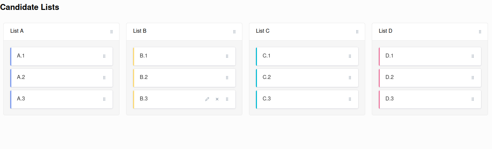

This project aims to allow you to model multi-list works council election representation outcomes given the latest revision of the works constitution act.

We implement the dhondt (aka greatest divisors) method to determine seat distribution for the popular vote, and to measure the gender quotas to determine any additional seat distribution that is needed.

It is likely this still does not work in several edge cases, so please seek a union representative, labor lawyer, etc for proper legal answers to questions about the works constitution act elections.

## Setup Requirements
This requires node 18 and `pnpm`

1. install `nvm`
2. `nvm install 18 && nvm use 18`
3. `npm install -g pnpm`

## Setup Application

4. `pnpm install`
4. `pnpm dev` to run the dev server
